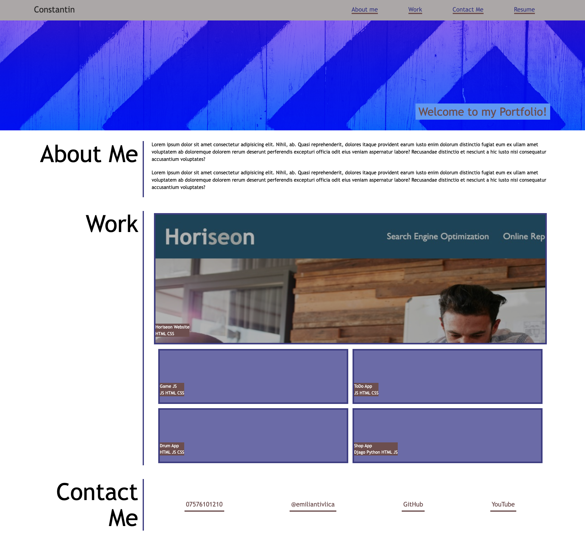

# CE-Tivlica-week2-Challenge
Week 2 Challenge Project

## Project Link 👇

* [@CE-Tivlica-week2-Challenge](https://constantin-e-t.github.io/CE-Tivlica-week2-Challenge/)

## Table of Contents 🔗

* [Description](#description)
* [Screenshots](#screenshots)
* [Authors](#authors)
* [Skills](#skills)
* [License](#license)

## Description

* Portfolio Website

* Practice css flex and grid

* Learned new ways to style the page and elements.

## Screenshots

## Authors

* [@Constantin-E-T](https://github.com/Constantin-E-T/)

## Skills

Javascript, HTML, CSS, Python, Django

## Tech Stack

**Client:** HTML, CSS

## License

[MIT](https://choosealicense.com/licenses/mit/)
